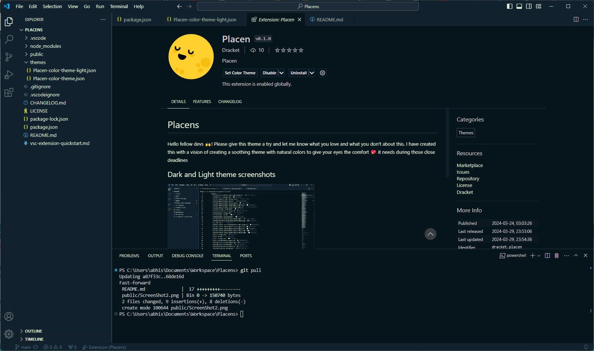

Themes colors followed

<h2>Followed color palette</h2>

<h2>Screenshots</h2>

If you have any suggestion or want to contribute. 
please find me at <a href="[url](https://github.com/chouhan-abhi/)https://github.com/chouhan-abhi/Placens">Placens</a>
